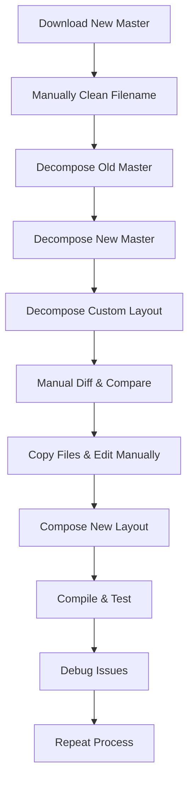
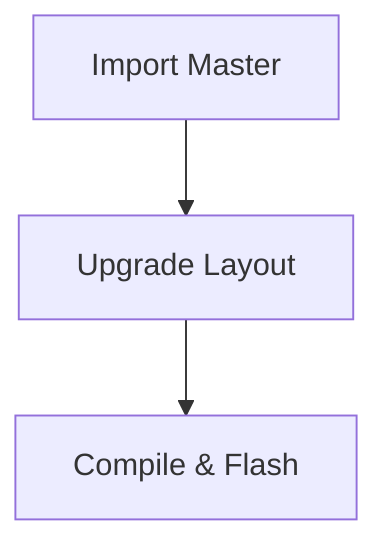

# Keymap Version Management

Glovebox provides powerful tools for managing keymap versions, allowing you to easily upgrade your customized layouts when new master versions are released while preserving all your customizations.

## Overview

The keymap version management system solves a common problem: when a new master layout version is released (e.g., Glorious Engrammer v41 → v42), you want to upgrade your customized version while keeping your personal customizations intact.

### Before Version Management

**Time: 30+ minutes, Error-prone, Manual work**

### With Version Management

**Time: <5 minutes, Automated, Zero data loss**

## Key Concepts

### Master Layouts
Master layouts are the original versions released by layout creators (like Glorious Engrammer). These serve as the base for your customizations.

### Custom Layouts  
Your personalized versions with custom layers, behaviors, and configurations.

### Version Tracking
Each layout tracks its version history and relationship to master layouts.

### Firmware Linking
Layouts automatically track which firmware files they've been compiled to, including build dates and hashes.

## Quick Start

### 1. Import a Master Layout
```bash
# Import a new master version for future upgrades
glovebox layout import-master ~/Downloads/glorious-engrammer-v42.json v42

# View available masters
glovebox layout list-masters glove80
```

### 2. Upgrade Your Custom Layout
```bash
# Upgrade preserving all customizations
glovebox layout upgrade my-custom-v41.json --to-master v42

# Specify output location
glovebox layout upgrade my-layout.json --to-master v42 --output my-layout-v42.json
```

### 3. Compare Layouts
```bash
# See what changed between versions
glovebox layout diff my-layout-v41.json my-layout-v42.json

# Compare your customizations with master
glovebox layout diff ~/.glovebox/masters/glove80/v41.json my-custom-v41.json
```

## Detailed Workflow

### Initial Setup

1. **Import Master Versions**
   ```bash
   # Import the master you're currently based on
   glovebox layout import-master glorious-v41.json v41
   
   # Import new master when available
   glovebox layout import-master ~/Downloads/glorious-v42-pre.json v42-pre
   ```

2. **Prepare Your Custom Layout**
   
   Ensure your custom layout has proper version metadata:
   ```json
   {
     "title": "My Custom Glorious Layout",
     "version": "1.0.0", 
     "base_version": "v41",
     "base_layout": "glorious-engrammer"
   }
   ```

### Upgrade Process

1. **Check Available Masters**
   ```bash
   glovebox layout list-masters glove80
   ```
   Output:
   ```
   Master versions for glove80:
   • v42-pre - Glorious Engrammer v42 preview (2024-01-15)
   • v41 - Glorious Engrammer v41 (2024-01-10)
   ```

2. **Review Changes**
   ```bash
   # See what changed in the new master
   glovebox layout diff ~/.glovebox/masters/glove80/v41.json ~/.glovebox/masters/glove80/v42-pre.json
   ```

3. **Upgrade Your Layout**
   ```bash
   glovebox layout upgrade my-custom-v41.json --to-master v42-pre
   ```
   
   Output:
   ```
   ✓ Upgraded layout from v41 → v42-pre
   📁 Output: my-custom-v41-v42-pre.json
   ✓ Preserved custom layers: MyCustomLayer, Gaming
   ✓ Preserved behaviors: 5 hold-taps, 12 combos
   ✓ Preserved config: COMBO_TIMEOUT, MOUSE_SPEED
   ```

4. **Test the Upgrade**
   ```bash
   # Compile new version
   glovebox firmware compile my-custom-v41-v42-pre.json --profile glove80/v25.05
   
   # Flash and test
   glovebox firmware flash firmware/my-custom-v41-v42-pre.uf2 --profile glove80/v25.05
   ```

5. **Rollback if Needed**
   ```bash
   # Revert to previous version if issues
   glovebox firmware compile my-custom-v41.json --profile glove80/v25.05
   glovebox firmware flash firmware/my-custom-v41.uf2 --profile glove80/v25.05
   ```

## File Organization

### Directory Structure
```
Your working directory:
├── my-custom-v41.json          # Your current layout
├── my-custom-v41-v42-pre.json  # Upgraded layout
└── firmware/
    ├── my-custom-v41.uf2       # Previous firmware
    └── my-custom-v41-v42-pre.uf2  # New firmware

Glovebox managed:
~/.glovebox/
└── masters/
    └── glove80/
        ├── v41.json            # Master layouts
        ├── v42-pre.json
        └── versions.yaml       # Metadata
```

### Master Storage
Master layouts are stored in `~/.glovebox/masters/{keyboard}/` and can be reused across multiple custom layouts.

## Preservation Strategy

The upgrade process intelligently preserves your customizations:

### ✅ Always Preserved
- **Custom metadata**: Title, creator, notes, tags
- **Custom layers**: Layers not in the original master
- **Custom behaviors**: Your hold-taps, combos, macros
- **Custom configuration**: Your Kconfig parameters
- **Custom code**: Device tree customizations

### 🔄 Updated from Master
- **Base layers**: Existing layers get improvements from new master
- **Master metadata**: Version, date, API version
- **Master behaviors**: New behaviors from master are added

### ⚡ Automatic Handling
- **Layer ordering**: Custom layers maintain their position
- **Dependency resolution**: References between layers are preserved
- **Validation**: Ensures upgraded layout is valid

## Command Reference

### Import Commands
```bash
# Import master layout
glovebox layout import-master <json_file> <version_name> [--force]

# List available masters
glovebox layout list-masters <keyboard> [--output-format table|json]
```

### Upgrade Commands  
```bash
# Upgrade layout
glovebox layout upgrade <custom_layout> --to-master <version> [--output <path>]

# Compare layouts
glovebox layout diff <layout1> <layout2> [--output-format summary]
```

### Example Workflows
```bash
# Weekly workflow: Check for new masters
glovebox layout list-masters glove80

# Monthly workflow: Import new master when available  
glovebox layout import-master ~/Downloads/new-master.json v43

# When ready: Upgrade custom layout
glovebox layout upgrade my-layout.json --to-master v43
```

## Advanced Features

### Firmware Tracking
Layouts automatically track their compiled firmware:

```json
{
  "last_firmware_build": {
    "date": "2024-01-15T10:30:00Z",
    "profile": "glove80/v25.05",
    "firmware_path": "firmware/my-layout.uf2", 
    "firmware_hash": "sha256:abc123...",
    "build_id": "8984a4e0-v25.05-598b0350"
  }
}
```

This enables:
- **Build verification**: Check if firmware matches layout
- **Change tracking**: Know when firmware needs rebuilding  
- **Rollback support**: Link layouts to their working firmware

### Batch Operations
```bash
# Import multiple masters
for file in ~/Downloads/*.json; do
  version=$(basename "$file" .json | cut -d'-' -f2)
  glovebox layout import-master "$file" "$version"
done

# Upgrade multiple layouts
for layout in my-layouts/*.json; do
  glovebox layout upgrade "$layout" --to-master v42
done
```

### Integration with Git
```bash
# Version control your layouts
cd my-keymaps/
git init
git add my-custom-v41.json
git commit -m "v41: Base layout"

# After upgrade
git add my-custom-v42.json
git commit -m "v42: Upgraded with new master features"
git tag v42
```

## Troubleshooting

### Common Issues

**Master not found:**
```bash
# Check available masters
glovebox layout list-masters glove80

# Import missing master
glovebox layout import-master path/to/master.json v42
```

**Upgrade conflicts:**
```bash
# Review what changed
glovebox layout diff old-master.json new-master.json

# Check your customizations  
glovebox layout diff master.json your-custom.json
```

**Validation errors:**
```bash
# Validate layout after upgrade
glovebox layout validate upgraded-layout.json

# Check layer consistency
glovebox layout show upgraded-layout.json
```

### Debug Mode
```bash
# Verbose upgrade output
glovebox -v layout upgrade my-layout.json --to-master v42

# Debug master import
glovebox --debug layout import-master master.json v42
```

## Best Practices

### Organization
1. **Consistent naming**: Use semantic versions (v1.0.0, v1.1.0)
2. **Regular imports**: Import masters when they're released
3. **Test upgrades**: Always test in a separate file first
4. **Document changes**: Use git commits to track upgrade history

### Safety
1. **Backup originals**: Keep working versions before upgrading
2. **Incremental testing**: Test each layer/feature after upgrade
3. **Rollback plan**: Know how to revert to previous firmware
4. **Version validation**: Ensure layouts compile before committing

### Workflow Integration
1. **CI/CD**: Automate layout validation and firmware builds
2. **Team sharing**: Share master imports across team members
3. **Release tracking**: Link layout versions to firmware releases
4. **Documentation**: Document custom modifications for future reference

## Migration Guide

### From Manual Workflow
If you're currently managing versions manually:

1. **Import your masters:**
   ```bash
   glovebox layout import-master old-master.json v41
   glovebox layout import-master new-master.json v42
   ```

2. **Update custom layout metadata:**
   Add version tracking to your existing custom layout:
   ```json
   {
     "version": "1.0.0",
     "base_version": "v41", 
     "base_layout": "master-name"
   }
   ```

3. **Test upgrade process:**
   ```bash
   glovebox layout upgrade custom-layout.json --to-master v42 --output test-upgrade.json
   ```

4. **Validate and switch:**
   ```bash
   glovebox firmware compile test-upgrade.json --profile glove80/v25.05
   # Test on device, then rename file when satisfied
   ```

## Advanced Layout Operations

### Field Manipulation
Precisely edit layout fields using dot notation:

```bash
# Get specific field values
glovebox layout get-field my-layout.json "title"
glovebox layout get-field my-layout.json "layers[0]"  
glovebox layout get-field my-layout.json "config_parameters[0].paramName"

# Set field values
glovebox layout set-field my-layout.json "title" "My Updated Layout"
glovebox layout set-field my-layout.json "creator" "YourName"
glovebox layout set-field my-layout.json "config_parameters[0].value" "y"
```

### Layer Management
Comprehensive layer operations with import/export:

```bash
# Add layers with import capabilities
glovebox layout add-layer my-layout.json "CustomLayer" --position 5
glovebox layout add-layer my-layout.json "SymbolLayer" --import-from symbol-layer.json

# Remove and reorder layers
glovebox layout remove-layer my-layout.json "UnusedLayer"
glovebox layout move-layer my-layout.json "SymbolLayer" --position 3
glovebox layout move-layer my-layout.json "LastLayer" -- -1  # Move to end

# Export layers for sharing or backup
glovebox layout export-layer my-layout.json "SymbolLayer" --format bindings --output symbol.json
glovebox layout export-layer my-layout.json "CustomLayer" --format layer --output custom-layer.json
```

### Enhanced Diff and Patching
Advanced comparison including DTSI code and automated patching:

```bash
# Enhanced diff with DTSI comparison
glovebox layout diff old-layout.json new-layout.json --include-dtsi --json

# Create and apply patches
glovebox layout create-patch old-layout.json new-layout.json --output changes.patch
glovebox layout patch my-layout.json upgrade-changes.json --output upgraded.json
```

### Automation and Integration
Combine operations for powerful workflows:

```bash
# Batch operations
for layout in layouts/*.json; do
  glovebox layout upgrade "$layout" --to-master v42
  glovebox layout set-field "$layout" "creator" "AutoUpdated"
done

# Version control integration
git add *.json
git commit -m "Upgrade all layouts to v42"
glovebox layout create-patch old-master.json new-master.json --output v42-changes.patch
git apply v42-changes.patch  # Apply changes to other branches
```

This system transforms keymap version management from a tedious manual process into a fast, automated workflow that preserves all your customizations while keeping you up-to-date with the latest improvements.